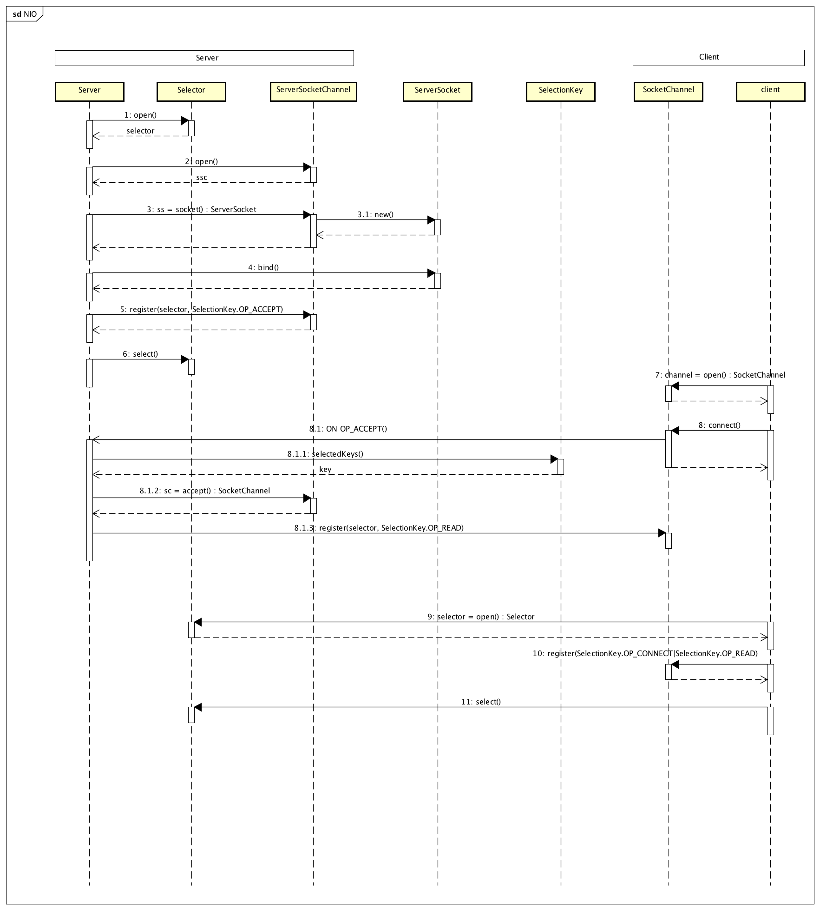

#   JAVA NIO
##  nio 类图

##  主要组件
*   Channels
    -    连接支持非阻塞IO的读/写的通道
*   Buffers
    -   Channels通道直接用来进行读/写操作的类数组对象
*   Selectors 
    -   能知道哪些Channels通道集合存在IO事件
*   SelectionKeys
    -   提供IO事件状态信息和IO事件绑定功能的类

##  NIO基本结构
*   1 。 服务端：
    -   创建一个 Selector，注册对各种 I/O 事件的兴趣的地方，而且当那些事件发生时，就是这个对象告诉您所发生的事件。
    -   服务端socketChannel,ServerSocketChannel打开ServerSocket
    -   ServerSocket绑定地址
    -   ServerSocketChannel在Selector注册监听accept事件
    -   调用 Selector 的 select() 方法。这个方法会阻塞，直到至少有一个已注册的事件发生。
        +   客户端SocketChannel调用connect到服务端地址时，出发OP_ACCEPT事件，阻塞结束，开始处理事件
            *   通过select的selectedKeys获取SelectionKey的集合，检查key的状态，从key中获取ServerSocketChannel
            *   从ServerSocketChannel中获取与客户端的SocketChannel，ssc2.accept()
            *   将与客户端的SocketChannel注册OP_READ,监听与客户端连接的READ事件，可以处理 客户端写入的信息
*   2 。 客户端：
    -   打开SocketChannel，连接指定服务地址
    -   打开Selector，并注册OP_CONNECT和OP_READ事件，处理连接和读取事件
    -   selector.select()阻塞等待事件发生
        +   连接完成
        +   服务段发送信息，从key中获取SocketChannel，读取服务端信息，和写入信息给服务端

#   参考
*   [并发编程网 - ifeve.com](http://ifeve.com/java-nio-vs-io/)
*   [NIO 入门](http://www.ibm.com/developerworks/cn/education/java/j-nio/j-nio.html)
*   [理解Java NIO](https://yq.aliyun.com/articles/2371)

