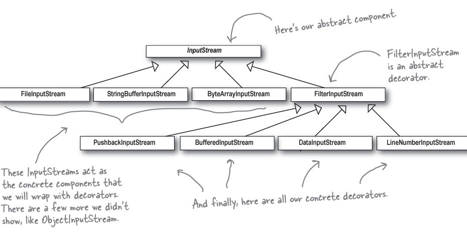
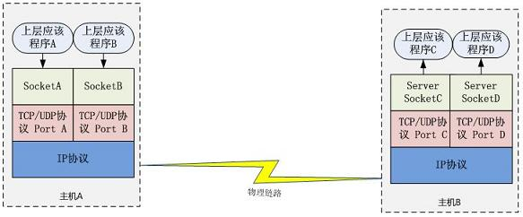

#   I/O
*   Java中I/O操作主要是指使用Java进行输入，输出操作. 
*   在 Java 编程中，直到最近一直使用 流 的方式完成 I/O。所有 I/O 都被视为单个的字节的移动，通过一个称为 Stream 的对象一次移动一个字节byte。流 I/O 用于与外部世界接触。它也在内部使用，用于将对象转换为字节，然后再转换回对象。
*   流与块的比较
原来的 I/O 库(在 java.io.*中) 与 NIO 最重要的区别是数据打包和传输的方式。正如前面提到的，原来的 I/O 以流的方式处理数据，而 NIO 以块的方式处理数据。


#   数据流的基本概念
*   流从概念上来说是一个连续的数据流。你既可以从流中读取数据，也可以往流中写数据。流与数据源或者数据流向的媒介相关联。在Java IO中流既可以是字节流(以字节为单位进行读写)，也可以是字符流(以字符为单位进行读写)。
*   将数据从外存中读取到内存中的称为**输入流**，将数据从内存写入外存中的称为**输出流**。
    *   
    *   Input  Stream不关心数据源来自何种设备（键盘，文件，网络）
    *   Output  Stream不关心数据的目的是何种设备（键盘，文件，网络）
*    程序从输入流读取数据源。数据源包括外界(键盘、文件、网络…)，即是将数据源读入到程序的通信通道。
    -   
*   程序向输出流写入数据。将程序中的数据输出到外界（显示器、打印机、文件、网络…）的通信通道。
    -   


#流的分类
*   根据流的来源分：结点流(原始流)，过滤器(链接流)
    -   结点流(原始流)：直接从指定的位置（如磁盘文件或内存区域）读或写，这类流称为结点流(node stream)
        +   ByteArrayInputStream：为多线程的通信提供缓冲区操作功能，接收一个Byte数组作为流的源。
        +   FileInputStream:建立一个与文件有关的输入流。接收一个File对象作为流的源。
        +   PipedInputStream：可以与PipedOutputStream配合使用，用于读入一个数据管道的数据，接收一个PipedOutputStream作为源。
        +   StringBufferInputStream：将一个字符串缓冲区转换为一个输入流
    -   过滤器(链接流)：其它的流，过滤器输入流往往是以其它输入流作为它的输入源，经过过滤或处理后再以新的输入流的形式提供给用户，过滤器输出流的原理也类似。 
        +   FilterInputStream称为过滤输入流，它将另一个输入流作为流源。这个类的子类包括以下几种：
            *   BufferedInputStream：用来从硬盘将数据读入到一个内存缓冲区中，并从缓冲区提供数据。
            *   DataInputStream：提供基于多字节的读取方法，可以读取原始类型的数据。
            *   LineNumberInputStream：提供带有行计数功能的过滤输入流。
            *   PushbackInputStream：提供特殊的功能，可以将已经读取的字节“推回”到输入流中。
        +   装饰器模式的应用： </br>
            *   FilterInputStream继承了InputStream,也引用了InputStream,而它有四个子类,这就是所谓的Decorator模式
            *   链接流链接流对象接收一个原始流对象或者另外一个链接流对象作为流源；另一方面他们对流源的内部工作方法做了相应的改变，这种改变是装饰模式所要达到的目的
*   根据它们操作对象的类型是字符还是字节可分为两大类： 字符流和字节流。
    -   JAVA字节流：InputStream是所有字节输入流的祖先，而OutputStream是所有字节输出流的祖先。
    -   Java的字符流：Reader是所有读取字符串输入流的祖先，而writer是所有输出字符串的祖先。
    -   适配器模式的应用： 从byte流到char流的适配
        +    InputStreamReader是从byte输入流到char输入流的一个适配器。InputStream的具体子类链接的时候，可以从InputStream的输出读入byte类型的数据，将之转换成为char类型的数据
        +    InputStream 到 Reader 的过程要指定编码字符集，否则将采用操作系统默认字符集，很可能会出现乱码问题。
            *    
```
public class InputStreamReader extends Reader {
        public InputStreamReader(InputStream in) {
        ...
        }
}
```


#磁盘 I/O 工作机制
*   创建文件对象file:`new File(path)`
    -   FileSystem fs:文件操作，都是native的方法
        +   delete
        +   list
        +   rename
*   创建 FileReader对象：`new FileReader(file)`
    -   FileReader extends InputStreamReader
        +   StreamDecoder sd: 创建一个解码器，
            *   InputStreamReader(InputStream in, String charsetName)，可以指定编码
        -   InputStreamReader(InputStream in)，需要一个输入字节流
            *   创建一个 fileInputStream 对象：`new  FileInputStream( file );`
                +   FileDescriptor：创建FileInputStream的时候回创建，都是native的方法：`fd = new FileDescriptor()`
                    *   关联真实存在的磁盘文件的文件描述符
                    *   真正读取文件的操作对象
```
        File file = new File(fileName);
        BufferedReader reader = null;
        try {
            System.out.println("以行为单位读取文件内容，一次读一整行：");
            reader = new BufferedReader(new FileReader(file));
            String tempString = null;
            int line = 1;
            // 一次读入一行，直到读入null为文件结束
            while ((tempString = reader.readLine()) != null) {
                //do some thing
                line++;
            }
            reader.close();
        } ....    
```


#   Java Socket 的工作机制
*   **Socket**
    -   网络上的两个程序通过一个双向的通信连接实现数据的交换，这个连接的一端称为一个socket。
    -   HTTP是轿车，提供了封装或者显示数据的具体形式；Socket是发动机，提供了网络通信的能力。
    -   Socket实质上提供了进程通信的端点，进程通信之前，双方首先必须各自创建一个端点，否则是没有办法建立联系并相互通信的。正如打电话之前，双方必须各自拥有一台电话机一样。
*   通信过程
    -   主机 A 的应用程序要能和主机 B 的应用程序通信，必须通过 Socket 建立连接，
    -   而建立 Socket 连接必须需要底层 TCP/IP 协议来建立 TCP 连接。
    -   建立 TCP 连接需要底层 IP 协议来寻址网络中的主机。我们知道网络层使用的 IP 协议可以帮助我们根据 IP 地址来找到目标主机，但是一台主机上可能运行着多个应用程序，如何才能与指定的应用程序通信就要通过 TCP 或 UPD 的地址也就是端口号来指定。这样就可以通过一个 Socket 实例唯一代表一个主机上的一个应用程序的通信链路了。
    -   
*   java Socket 通信：
    -   
    -   客户端：
        +   客户端首先要创建一个 Socket 实例，操作系统将为这个 Socket 实例分配一个没有被使用的本地端口号，
        +   在创建 Socket 实例的构造函数正确返回之前，将要进行 TCP 的三次握手协议，TCP 握手协议完成后，Socket 实例对象将创建完成，否则将抛出 IOException 错误。
    -   服务端：
        +   服务端将创建一个 ServerSocket 实例，ServerSocket 创建比较简单只要指定的端口号没有被占用，一般实例创建都会成功。
        +   accept()方法：
            +   进入阻塞状态，等待客户端的请求
            +   当一个新的请求到来时，将为这个连接创建一个新的socket，该套接字数据的信息包含的地址和端口信息正是请求源地址和端口。
            +   这个新创建的数据结构将会关联到 ServerSocket 实例的一个未完成的连接数据结构列表中，注意这时服务端与之对应的 Socket 实例并没有完成创建，而要等到与客户端的三次握手完成后，这个服务端的 Socket 实例才会返回，并将这个 Socket 实例对应的数据结构从未完成列表中移到已完成列表中。
            +   所以 ServerSocket 所关联的列表中每个数据结构，都代表与一个客户端的建立的 TCP 连接。
        +   backlog 参数，ServerSocket初始化是可以指定，默认50
            *   一个队列的最大长度，服务端监听端口，等待客户端连接，客户端连接到来时先进入该队列，accept()方法从里面取出连接处理返回一个新的socket与客户端socket通信
            *   如果客户端并发过高，accept来不及处理，导致等待accept处理的连接超过指定的队列长度，和客户端就会java.net.ConnectException: Operation timed out
*   数据传输
    -   连接已经建立成功，服务端和客户端都会拥有一个 Socket 实例，每个 Socket 实例都有一个 InputStream 和 OutputStream，正是通过这两个对象来交换数据。
    -   当 Socket 对象创建时，操作系统将会为 InputStream 和 OutputStream 分别分配一定大小的缓冲区，数据的写入和读取都是通过这个缓存区完成的。
    -   写入端将数据写到 OutputStream 对应的 SendQ 队列中，当队列填满时，数据将被发送到另一端 InputStream 的 RecvQ 队列中，如果这时 RecvQ 已经满了，那么 OutputStream 的 write 方法将会阻塞直到 RecvQ 队列有足够的空间容纳 SendQ 发送的数据。
    -   这个缓存区的大小以及写入端的速度和读取端的速度非常影响这个连接的数据传输效率，由于可能会发生阻塞，所以网络 I/O 与磁盘 I/O 在数据的写入和读取还要有一个协调的过程，如果两边同时传送数据时可能会产生死锁。

#   5中I/O模型
*   阻塞式I/O </br>

*   非阻塞式I/O </br>

*    I/O复用（Java NIO就是这种模型） </br>

*   信号驱动式I/O ,异步I/O </br>


#   参考
*   [java IO Stream详细解读](http://www.cnblogs.com/lcw/p/3499935.html)
*   [深入分析 Java I/O 的工作机制](https://www.ibm.com/developerworks/cn/java/j-lo-javaio/index.html)